---

title: "My eCPPTv3 Exam Review — A Detailed Breakdown"
published: 2026-08-22
description: "My honest eCPPTv3 exam review, covering preparation, Active Directory, web application testing, privilege escalation, hash cracking, tools, exam experience, and practical tips."
image: "ecpptv3.png"
tags: [eCPPTv3, Active Directory, Web Security, Penetration Testing]
category: "Certifications"
lang: "en"
---

# My eCPPTv3 Exam Review — A Detailed Breakdown


I sat the eCPPTv3 a little while back, and I’ve been meaning to sit down and write out everything I went through while it’s still fresh. The good parts, the annoying parts, the stuff nobody mentions before you book it.

I spent about 1–3 months prepping, between the course itself and a pretty heavy stack of outside material, and when exam day actually came, I finished in roughly half the time I was given.

That probably sounds impressive. It wasn’t, really — it just meant I’d already been burned enough times in prep that I walked in knowing exactly where the traps were.

So let me walk you through the whole thing, start to finish, and hopefully save you a few of those burns.

## What You Can Honestly Skip in the Course

Go through the INE material closely enough and you’ll notice a few sections that, at least when I sat the exam, never actually came up: client-side attacks, the system security and x86 assembly module, buffer overflow exploit development, and the command-and-control section.

Technically, you could speed-run all four and be totally fine on exam day.

I wouldn’t do that, though.

None of that is dead knowledge — assembly, VBA macro attacks, C2 frameworks, all of it still shows up constantly in real engagements. And honestly, if you’ve already paid for the course, skipping content that’s genuinely resume-worthy just because it won’t be graded feels like leaving money on the table.

I went back and worked through those sections anyway, and I’m glad I did. Even when none of it turns into a flag on exam day, understanding how a C2 framework actually behaves under the hood, or how a macro payload sneaks past a mail filter, quietly changes how you think about everything else you’re doing.

## Why the Course on Its Own Won’t Cut It

Here’s the part that genuinely annoyed me: the course by itself did not get me ready for this exam. Not close.

I ended up building out a whole side-track of studying just to feel prepared, and if I’m being honest, that extra studying probably mattered more than the course did.

For Active Directory, HackTheBox did most of the heavy lifting — their **Introduction to Active Directory** module, then **Active Directory Enumeration & Attacks**, and after that I just kept chipping away at the other AD rooms scattered through their CPTS path.

None of that felt optional.

AD is one of those topics where reading about it and actually doing it live in completely different worlds — enumerating users, shares, group memberships, trust relationships, it only starts to click once you’ve done it fifty times across slightly different setups and started noticing the patterns repeat.

I also spent real hours just getting fast with the Impacket AD tools specifically, because there’s a huge gap between ΓÇ£I’ve heard of `GetNPUsers.py`ΓÇ¥ and actually being able to fire it correctly on the first try while a clock is running.

The web app side was simpler in comparison — HackTheBox’s WordPress course, then just grinding through as many TryHackMe web rooms as I could stand.

No real shortcut there. It’s pure repetition until pattern recognition kicks in.

By exam day, spotting a WordPress install off a brute-forced directory listing, or instinctively checking `wp-config.php` the second I landed a shell, wasn’t something I had to consciously think about anymore.

That kind of instinct doesn’t come from reading a walkthrough once. It comes from doing the same motion dozens of times until your hands know it before your brain catches up.

## What the Exam Actually Feels Like

This is a real jump from the eJPTv2 — not a gentle step up, a genuine leap.

Go in already comfortable with your tools, because exam day is not the time to be Googling syntax for the first time.

One thing I can’t stress enough: **take detailed notes, and start that habit during the course, not just once the clock starts on the real thing.**

You’ll end up with multiple CMD windows open at once, bouncing between machines, and it’s shockingly easy to lose your place — what you’ve already tried, what worked where, which creds go with which box.

My notes ended up being the single biggest time-saver whenever I circled back to a machine hours later and needed to remember what I’d already ruled out.

I basically built mine like a mini engagement report as I went, host by host, every credential and share and dead end logged, because there’s just no way to hold all of that in your head on an exam this size.

Small thing, but worth saying anyway: **start your exam in Chrome.** I’ve seen enough people run into weird issues on other browsers that it’s just not worth the risk.

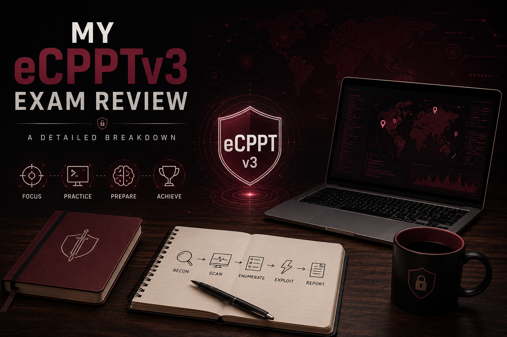

## How I Actually Started — Recon and Mapping the Environment

Before I touched a single service, the first thing I did was figure out where I actually stood on the network.

Just a quick:

```bash
ifconfig
```

to confirm which interface I was attacking from and what subnet I was actually part of.

Sounds almost too basic to mention, but scanning the wrong range because you assumed your subnet is a mistake that costs you real time later, and I’ve made it before.

From there, a wide ping sweep to find live hosts before wasting effort probing ports on things that weren’t even up.

That sweep told me more than I expected — a handful of Windows machines, a Linux web server, and, more interestingly, two separate Active Directory domains sitting side by side.

Two domain controllers, two different domain names, and something about the setup that hinted at a parent/child or trust relationship between them.

Easy detail to skim past in the moment. Ends up mattering a lot once you’re staring at credentials that work perfectly on one domain and go nowhere on the other.

Once I had a list of live hosts, CrackMapExec’s SMB module became my default move for fast fingerprinting — it pulls OS build, hostname, and domain straight off the SMB banner in one pass, which beats running a full Nmap service scan across an entire subnet of Windows boxes.

One detail from that scan stuck with me: SMB signing was on for both domain controllers but off on the two non-DC boxes.

Not something you exploit right away, but it’s exactly the kind of flag worth writing down early, since it tells you which machines are theoretically open to SMB relay attacks if you manage to grab credentials later.

I also made a point of explicitly checking that Kerberos and LDAP were reachable on both domain controllers rather than just assuming it from the OS fingerprint.

Small check, but it confirmed these were genuine, working DCs and not just file servers with the role technically switched on and never used.

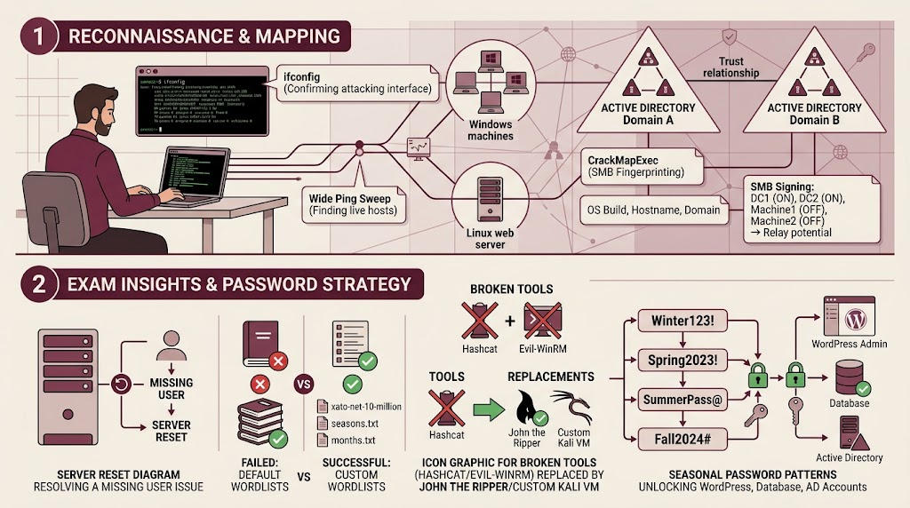

## The Rough Edges of the Exam

Because this exam is still fairly new, it’s not entirely polished, and there are a few things worth flagging so they don’t throw you off the way they threw me.

The environment itself isn’t fully stable.

At one point I had a question asking me to find a specific user on a specific machine, and that user simply didn’t exist anywhere.

Not until I reset the lab — and then, suddenly, there it was.

If you hit something that feels genuinely impossible, don’t automatically assume you’re missing something obvious.

Sometimes the machine just needs a reset, and that’s on the platform, not on you.

The wordlists listed in the letter of engagement for password cracking and brute-forcing are, frankly, misleading.

They got me nowhere.

What actually worked was switching to `xato-net-10-million-passwords-10000.txt`, along with `seasons.txt` and `months.txt`.

Just keep those loaded from the start instead.

And on the attacker machine itself, Hashcat and Evil-WinRM didn’t work properly for me.

So you’ve got two real options: fall back on John the Ripper instead of Hashcat, or spin up your own Kali VM so you’ve got a working Hashcat install when you inevitably need one.

One pattern that saved me a surprising amount of time once I clocked it: this whole environment leans hard on seasonal, policy-driven passwords.

Think:

```text
Season+Year+SpecialChar
```

For example:

```text
Winter123!
5pr1ng2022@
```

I first ran into it cracking a WordPress admin login, then saw the exact same pattern again inside the site’s database config, then again later on domain accounts that had nothing to do with the web app.

Once that clicked, I stopped brute-forcing blind and started spraying a small seasonal wordlist first.

It’s a genuinely good real-world lesson too: rotation policies without complexity or history enforcement don’t stop weak passwords, they just teach everyone the same predictable pattern.

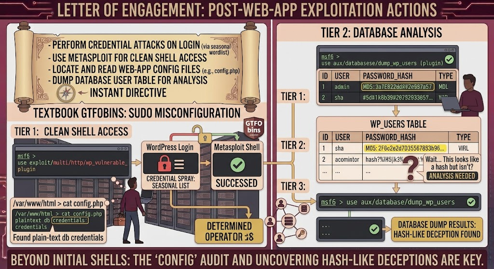

## What You’re Actually Walking Into

Expect a lot of Windows machines — this is an AD-heavy exam, so no surprise there.

Linux boxes show up too, so don’t let your Windows prep crowd out the fundamentals on that side.

There’s a web application to pentest as well, and in my case it turned out to be a fairly standard WordPress install once I actually dug into it.

A directory brute-force surfaced the login page almost immediately, which narrowed things down fast to core WordPress bugs, plugin vulnerabilities, or just weak credentials.

Credential attacks against that login — using the seasonal wordlist logic again — got me in as admin.

From there, instead of manually fumbling with a theme editor to drop a shell, a Metasploit module targeting a known vulnerable plugin got me a proper shell with a lot less friction.

Good general exam lesson buried in there: **if a known module already does what you’re trying to do, use it. Don’t reinvent it under time pressure.**

Once I had a shell, the config file was the very next stop.

It holds database credentials in plaintext by design, so it’s one of the first things any web attacker checks the second they land.

From there it was straight into the database, dumping the user table, and that’s where things got genuinely interesting, because it turned out not everything that looks like a password hash actually is one.

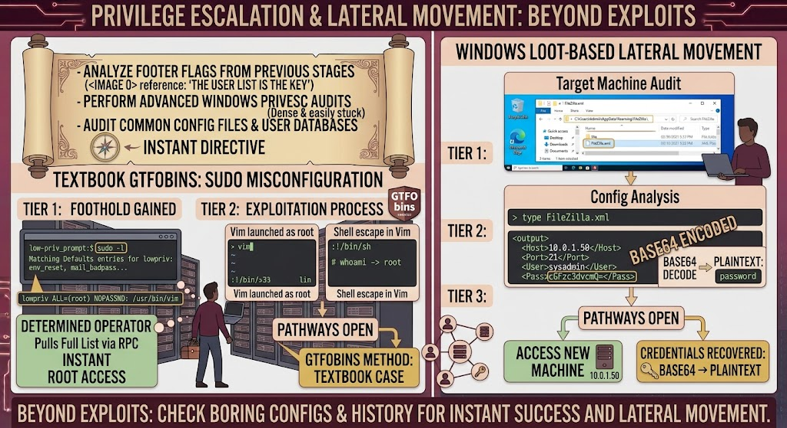

## Privilege Escalation and Credential Looting

The part that trips up the most people — myself included, for a while — is advanced Windows privilege escalation.

It’s dense, and it’s very easy to get stuck spinning your wheels there for way longer than you’d like.

One Linux box I landed on had a sudo misconfiguration that let a low-privilege user run Vim as root with zero password required — a textbook GTFOBins case, since Vim’s shell escape inherits whatever privilege sudo was granted.

Obvious in hindsight, easy to miss in the moment if `sudo -l` isn’t already a reflex on every single foothold you land.

On the Windows side, privilege escalation came down to loot more often than exploits for me.

I found a FileZilla config sitting in an admin’s AppData folder with a saved connection, credentials ΓÇ£encodedΓÇ¥ in Base64 rather than actually encrypted — and decoding it handed me access to a completely different machine than the one I found the file on.

Good reminder that a lot of lateral movement isn’t clever exploitation at all.

It’s just checking the boring, obvious places people leave things lying around — saved browser passwords, FTP configs, PowerShell history, and all of it.

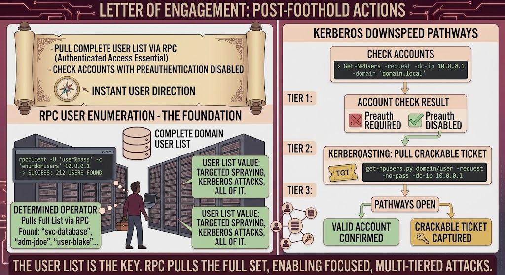

## Active Directory Enumeration

PowerShell-based AD enumeration is basically non-negotiable here.

You need to be fluent, not just vaguely familiar.

A big chunk of my time on the Windows side went into enumerating domain shares once I had any valid credential at all, and it’s worth being methodical rather than just eyeballing whatever looks interesting.

Most shares you’ll find are the usual default admin shares that don’t tell you much on their own.

But every so often you’ll hit something like a general-purpose share with write access, and that’s always worth a second look.

Could mean an uploadable path into a web app, could mean a scheduled task waiting to be hijacked.

On the scanning front, I never once needed a full 65535-port scan; the first 9999 ports were consistently enough.

And a few machines actually offered more than one route in, which is a genuinely nice bit of breathing room when your first idea isn’t panning out.

Getting a real list of domain usernames mattered more than I expected going in.

Once you’ve got any authenticated credential at all, pulling the full user list via RPC beats guessing at usernames by a mile, and it opens the door to everything downstream — targeted spraying, Kerberos attacks, all of it.

On the Kerberos side, checking for accounts with preauthentication disabled once you have a foothold is worth doing early, since it lets you pull back a crackable ticket without already knowing the password.

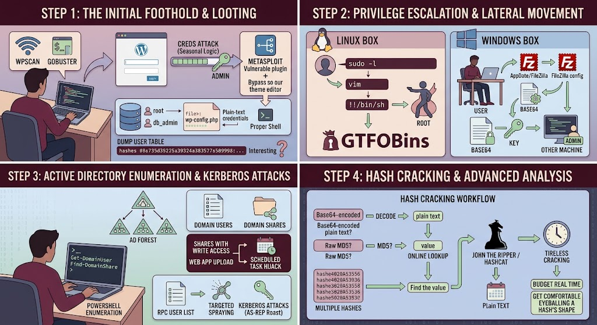

## Hash Cracking

And then, of course, there’s the hash cracking.

A lot of it.

This was, honestly, the hardest single part of the whole exam for me — not because of any one machine, but because of the sheer volume required and how much time it can quietly eat if you’re not organized about it.

Part of what made it hard wasn’t even the cracking itself.

It was figuring out what I was actually looking at before committing to a method.

One ΓÇ£hashΓÇ¥ pulled from a database dump turned out to just be Base64-encoded plaintext dressed up to look cryptographic — decoded in about two seconds flat once I stopped trying to crack it like a real hash.

Others were raw, unsalted MD5 with no prefix at all, which I ran through an online lookup instead of burning local CPU cycles, since common unsalted MD5s are often already present in public lookup databases.

Budget real time for this specifically.

And get comfortable eyeballing a hash’s shape — length, structure, whether it even resembles a real algorithm’s output — before you commit to a cracking approach that might turn out to be a complete waste of an hour.

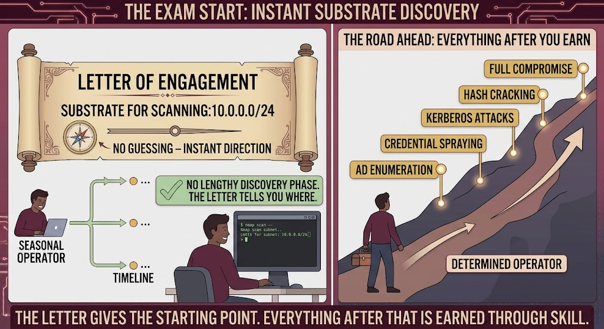

## Target IPs — Don’t Overthink It

This part is genuinely simple, so I won’t overcomplicate it.

Once the exam starts, you get a letter of engagement telling you exactly which subnet to scan.

No guessing, no lengthy discovery phase to figure out where to even look.

It was, by a wide margin, the fastest and least stressful part of the entire exam.

The letter tells you where.

Everything after that, you have to earn.

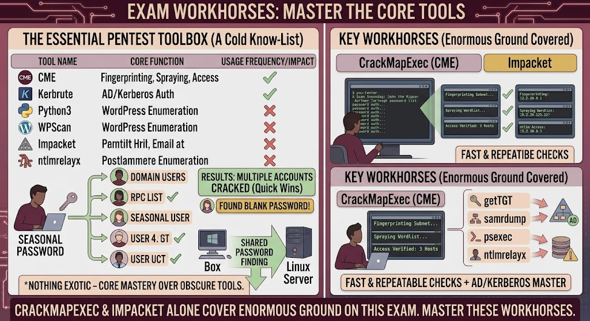

## Tools That Actually Got Used

The tools I kept coming back to, over and over:

* CrackMapExec
* Kerbrute
* Impacket
* Nmap
* xfreerdp
* BloodHound
* WPScan
* Burp Suite
* Metasploit
* Mimikatz
* Hydra
* John the Ripper
* Hashcat
* Msfvenom
* PowerView.ps1
* PowerUp.ps1
* Evil-WinRM
* SearchSploit
* Netcat
* Python3

Nothing exotic in there — it really is just about knowing this core set cold rather than chasing anything obscure.

If I had to pick the two workhorses, it’d be **CrackMapExec** for fast, repeatable checks across the whole subnet — fingerprinting, spraying, verifying access — and **Impacket** for basically anything Kerberos or AD-authentication related.

Between those two alone, you cover an enormous amount of ground on this exam.

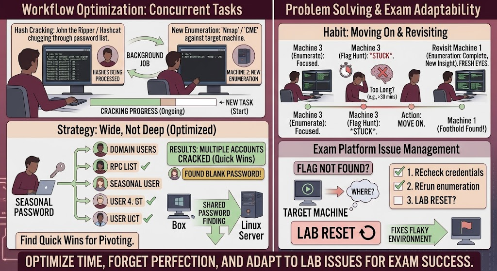

## A Few Things That Actually Helped Me

Since hash cracking was my biggest bottleneck, the single thing that saved me the most time was starting cracking jobs early and letting them run in the background while I kept enumerating other machines.

I also got better at catching myself whenever I’d been staring at one machine, one flag, for too long.

If nothing was clicking after a reasonable stretch, I’d force myself to move on and come back later with fresh eyes.

Given how flaky the environment can get, that habit alone spared me a few false dead ends, including the one where a flag genuinely didn’t exist until a reset fixed it.

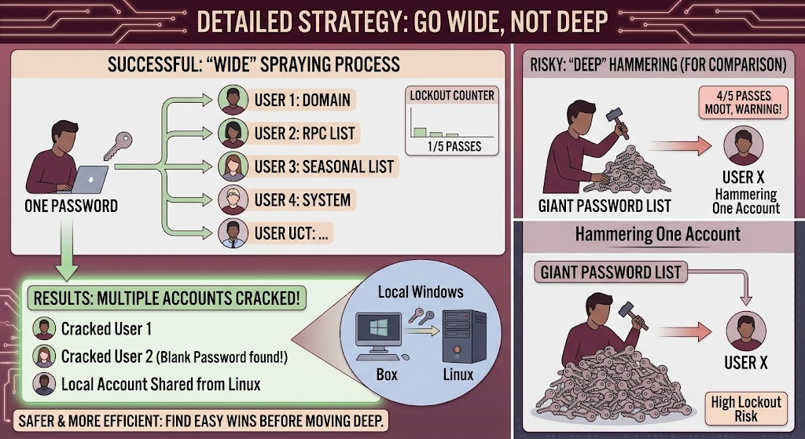

## Notes and Mindset

On spraying specifically, I got into the habit of going wide before going deep — one password against a whole list of usernames, rather than hammering a single account with a giant password list.

Safer against lockout policies too, since each account only takes one hit per pass.

On the AD side it paid off nicely: a single spray with one seasonal password across a list of domain users pulled via RPC turned up several valid accounts at once, including one with a completely blank password — the kind of finding that’s worth flagging entirely on its own.

Worth remembering, too, that not every account belongs to the domain.

I ran into a local account on one Windows box that shared a password with an account from the Linux side entirely, which only made sense once I connected two systems I’d been treating as unrelated up to that point.

Notes were everything, and I mean structured notes, not a running text dump.

Mine were organized by host rather than chronologically, so I could jump straight into a specific machine’s section without scrolling through everything else to find it.

Even failed commands got logged.

In an AD environment, something that fails now can quietly become relevant later once you’ve picked up more credentials or a bit more access.

And because hash cracking ate so much of my time, I kept one central running list of every hash, its type, and its status, instead of letting that scatter across a dozen different note pages.

Probably saved me an hour or more on its own, and made it trivial to notice patterns — like realizing three ΓÇ£differentΓÇ¥ hashes from three different hosts all decoded to the same weak password.

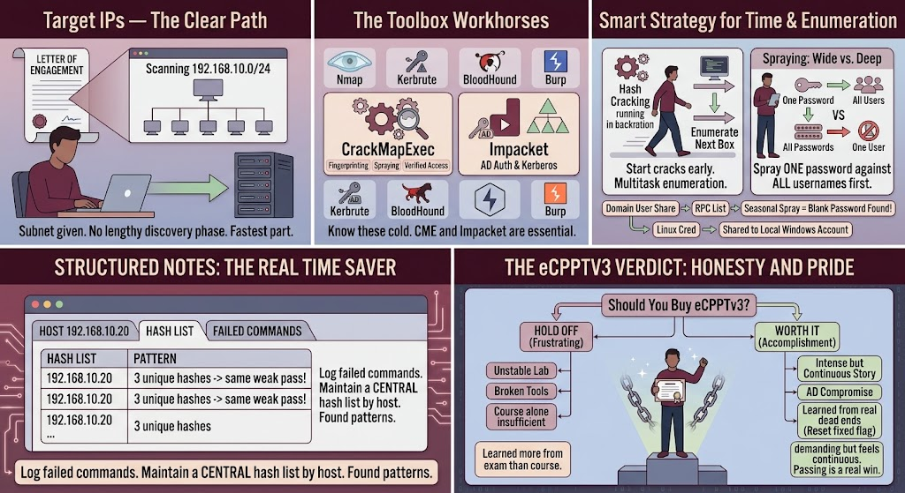

## Where I Landed on All This

If you’re asking me straight up whether to buy an eCPPTv3 voucher right now, my honest answer is: **hold off.**

The lab environment is unstable, several tools flat-out don’t work, and the course alone will not get you exam-ready no matter how well you know it — you’ll need outside resources regardless.

Given what the certification costs, that combination was genuinely frustrating more than once.

I might feel differently if the course gets a real overhaul at some point.

But based on what I actually went through, I walked away having learned more from the exam itself than from the course that was supposed to prepare me for it in the first place.

That’s backwards, and it should probably change.


Even so — passing this thing was a real accomplishment, and I don’t want that to get lost in all the complaining above.

It was demanding, occasionally maddening — hash cracking, mostly, if we’re naming names — and I’m genuinely proud I got through it.y

Looking back at the whole run — the recon, chaining a web app foothold into database credentials, pivoting that into a Linux privilege escalation, then carrying that same ΓÇ£people reuse passwords, always check for itΓÇ¥ instinct all the way into a full AD compromise — it stopped feeling like a checklist of disconnected exercises somewhere along the way and started feeling like one continuous story.

Which, honestly, is probably the whole point of an exam like this.

Good luck if you’re going for it. Happy to answer questions if anyone has them.
